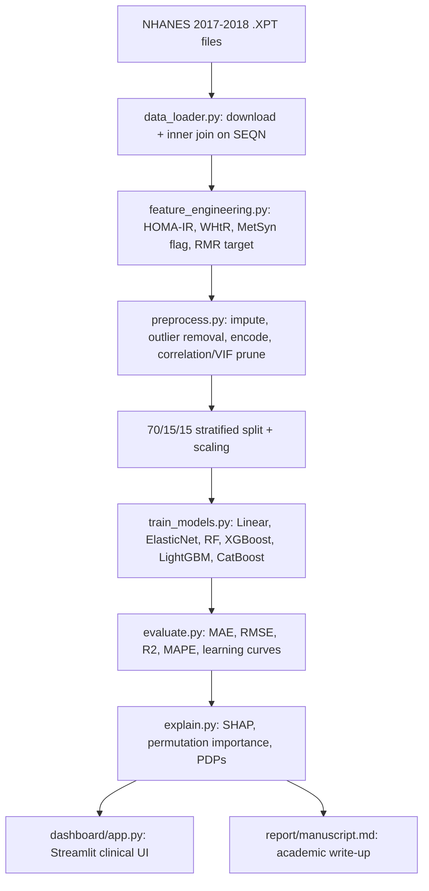

# Explainable AI for Personalized Resting Metabolic Rate Prediction


An explainable machine learning pipeline for predicting Resting Metabolic
Rate (RMR) from demographic, anthropometric, laboratory, and behavioral
data in the NHANES 2017–2018 cohort, developed as a portfolio project for
PhD applications in Exercise Physiology, Metabolism, and Obesity research.

> **⚠️ Data status:** this repository ships fully working, documented code
> for every pipeline stage. It does **not** ship a pre-downloaded NHANES
> dataset or pre-trained model, because fetching the raw `.XPT` files
> requires general internet access that isn't available in the environment
> this repo was authored in. Run `src/data_loader.py` yourself (see
> [Installation](#installation)) to populate `data/` and `models/`.

---

## Motivation and Clinical Relevance

Resting Metabolic Rate (RMR) — energy expended at rest to sustain basic
physiological function — underlies clinical decisions in weight
management, metabolic disease, and sports nutrition. Gold-standard
measurement (indirect calorimetry) is costly and rarely available at
population scale, so most clinical and research settings rely on
predictive equations such as Mifflin-St Jeor. This project asks whether a
richer, ML-based model — trained on a nationally representative sample
and made interpretable via SHAP — can surface which demographic and
metabolic factors matter most, and by how much, for individual patients.

## Dataset

| Component | Description | NHANES file |
|---|---|---|
| Demographics | Age, sex | `DEMO_J` |
| Body measurements | Weight, height, BMI, waist circumference | `BMX_J` |
| Blood pressure | Systolic/diastolic BP | `BPX_J` |
| Fasting glucose | Glycemic status | `GLU_J` |
| HbA1c | Long-term glycemic control | `GHB_J` |
| HDL cholesterol | Lipid profile | `HDL_J` |
| Total cholesterol | Lipid profile | `TCHOL_J` |
| Triglycerides & insulin | Lipid profile, insulin resistance | `TRIGLY_J` |
| Physical activity | Self-reported activity level | `PAQ_J` |
| Diabetes questionnaire | Diagnosed diabetes status | `DIQ_J` |

Files are merged on `SEQN` (inner join). NHANES does not measure RMR
directly, so the target is computed from the **Mifflin-St Jeor equation**,
the most widely validated RMR estimating equation in clinical nutrition:

- **Men:** RMR = 10·weight(kg) + 6.25·height(cm) − 5·age + 5
- **Women:** RMR = 10·weight(kg) + 6.25·height(cm) − 5·age − 161

This is an explicit modeling choice, not a limitation to hide: the ML
models are trained to reproduce/refine an equation-based target using a
much richer feature set than the equation itself uses, and SHAP is used
to check whether the model is (correctly) leaning almost entirely on
weight/height/age/sex, or picking up meaningful secondary structure from
metabolic covariates.

## Methodology



## Installation

```bash
git clone <your-repo-url>
cd rmr_prediction_project

# Option A: conda
conda env create -f environment.yml
conda activate rmr-prediction

# Option B: pip
python -m venv venv && source venv/bin/activate
pip install -r requirements.txt
```

## Usage

```bash
# 1. Download + merge NHANES 2017-2018 components (requires internet access)
python src/data_loader.py --config config.yaml

# 2. Run feature engineering + preprocessing + model training via the notebooks,
#    or programmatically:
python - <<'PY'
import yaml, pandas as pd
from src.feature_engineering import engineer_all_features
from src.preprocess import run_full_preprocessing
from src.train_models import train_all_models, select_and_save_best_model
from src.evaluate import evaluate_all_models

config = yaml.safe_load(open("config.yaml"))
df = pd.read_csv(config["paths"]["merged_csv"])
df = engineer_all_features(df, config)
splits = run_full_preprocessing(df, "RMR_kcal_day", config)
fitted_models, leaderboard = train_all_models(splits, config)
select_and_save_best_model(fitted_models, leaderboard, config)
print(leaderboard)
print(evaluate_all_models(fitted_models, splits, config))
PY

# 3. Launch the dashboard
streamlit run dashboard/app.py
```

## Results

*Populate this table after running the pipeline on real NHANES data —
values below are placeholders illustrating the expected reporting format.*

| Model | CV R² (mean ± sd) | Test MAE | Test RMSE | Test R² | Test MAPE |
|---|---|---|---|---|---|
| Linear Regression | — | — | — | — | — |
| Elastic Net | — | — | — | — | — |
| Random Forest | — | — | — | — | — |
| XGBoost | — | — | — | — | — |
| LightGBM | — | — | — | — | — |
| CatBoost | — | — | — | — | — |

## Explainability

- **SHAP global summary** — ranks features by mean |SHAP value| across the
  test set.
- **SHAP waterfall** — per-patient explanation of how each feature pushed
  the prediction above/below the population baseline.
- **SHAP dependence + interaction plots** — how a feature's marginal
  effect changes across its range and with a second feature (e.g. Age × BMI).
- **Permutation importance** — model-agnostic cross-check against SHAP.
- **Partial dependence plots** — average marginal effect of top features.

## Dashboard

`dashboard/app.py` is a Streamlit clinical-style tool: enter patient
demographics/labs, get a predicted RMR, an approximate prediction
interval, a BMI-based risk badge, and a SHAP waterfall explaining that
specific prediction — plus plain-language clinical interpretation notes.

## Limitations

- The target (RMR) is equation-derived, not directly measured — the model
  cannot outperform indirect calorimetry as ground truth, only approximate
  Mifflin-St Jeor with additional covariate context.
- NHANES is cross-sectional; no causal claims about metabolic drivers of
  RMR can be made from this data.
- Self-reported physical activity (PAQ) is subject to recall/social
  desirability bias.
- Generalizability is bounded by the 2017-2018 U.S. NHANES sampling frame.

## Future Work

- Validate against a cohort with directly measured RMR (indirect
  calorimetry) to test whether ML predictions outperform Mifflin-St Jeor
  on *true* RMR, not just on itself.
- Incorporate additional NHANES cycles for larger sample size and
  temporal robustness checks.
- Add body-composition biomarkers (e.g., DXA-derived fat-free mass, when
  available) as features.

## License

MIT — see [LICENSE](LICENSE).

## Citation

```
[Your Name]. (2026). Explainable AI for Personalized Resting Metabolic
Rate Prediction Using NHANES 2017-2018 Data. GitHub repository.
```
